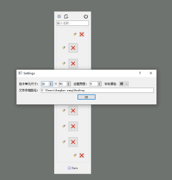
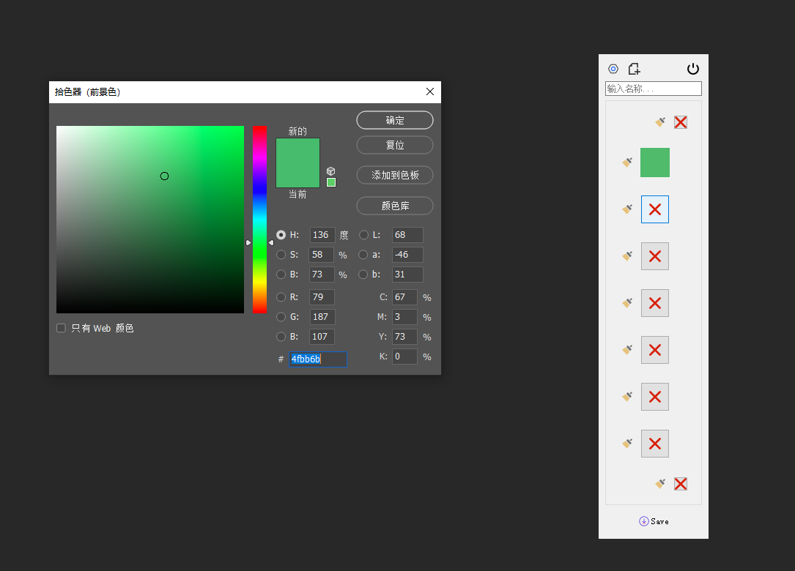
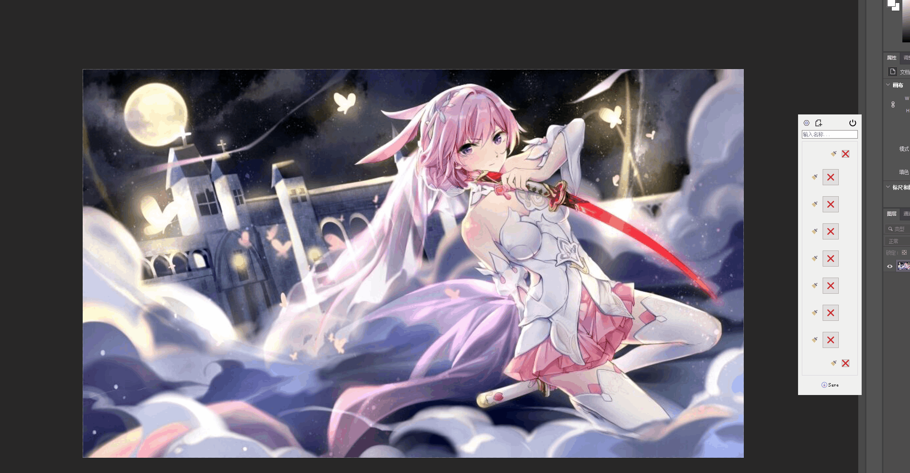

# ColorCardMaker 
## This tool is to help making color appointing on a design draft. This will be the color card finally looks like: 
 
the software looks like: 
 
 

# dependencies
python3 
pyqt5 
PIL 
photoshop(https://github.com/loonghao/photoshop-python-api)

(limited on ps 2020
 cc2019
 cc2018
 cc2017
 cs6)

